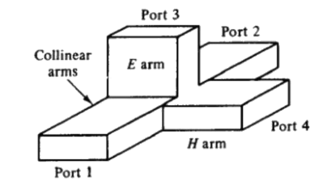
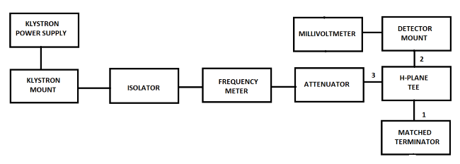
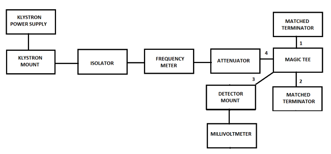
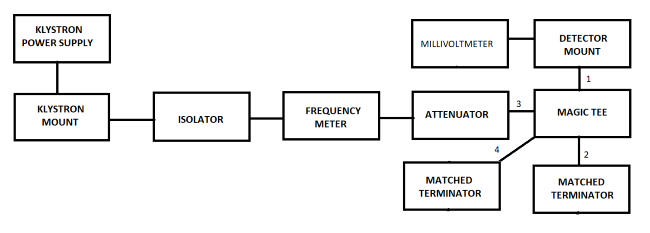
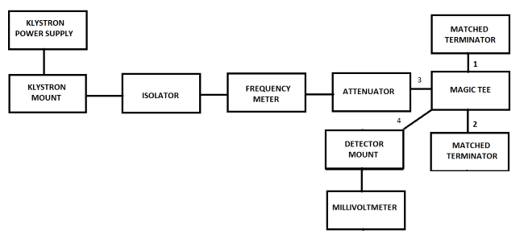

### Introduction

### E-Plane Tee

An E-plane tee is a waveguide tee in which the axis of its side arm is parallel to the E field of the main guide (see Fig. 1). If the collinear arms are symmetric about the side arm, there are two different transmission characteristics. It can be seen from Fig. that if the E - plane tee is perfectly matched with the aid of screw tuners or inductive or capacitive windows at the junction, the diagonal components of the scattering matrix, **S11,S22,and S33,** are zero because there will be no reflection. When the waves are fed into the side arm (port 3), the waves appearing at port 1 and port 2 of the collinear arm will be in opposite phase and in the same magnitude. Therefore  

**S13=−S23**

It should be noted that above Eq. does not mean that S13 is always positive and S23 is always negative. The negative sign merely means that S13 and S23 have opposite signs.

 

**Fig. 1 E-plane Tee**

 

**Fig. 2 Input from side arm**

### H-Plane Tee

When the axis of the side arm of the waveguide tee is parallel to the flow of the Magnetic Field (H) from port 1 and is perpendicular to the flow of the Electric Field (E), then the tee is called a H-Plane Waveguide Tee.  

**Fig. 3 H-plane Tee**

An H-Plane Waveguide Tees can be thought of as a two way in-phase power divider/combiner i.e it is additive in nature. When two input signals are fed to port 1 & 2, the output at port 3 is in phase and additive and when the input signal is fed to port 3, the signal is split in to two equal parts that are in-phase at port 1 & 2.

  
### Magic Tee

A Magic Tee or Hybrid Tee is a 4 port waveguide tee that is a combination of an E-Plane and H-Plane Waveguide Tee.  
  

**Fig. 4 Magic Tee**

  
A magic tee has four ports:

*   Port 1 - Co-linear
*   Port 2 - Co-linear
*   Port 3 - Difference Port
*   Port 4 - Sum Port

Operation of a Magic Tee:

*   Case 1: When two signals of equal magnitude are fed from port 1 and 2, we get a zero at port 3 and the sum of the two signals at port 4.
*   Case 2: When a signal is fed through port 4, it gets divided equally between port 1 & 2 and both the outputs are in phase. No output comes from port 3.
*   Case 3: When a signal is fed through port 3, we get an output of equal magnitude but opposite phase at port 1 & 2 (the signals are 180 degrees out of phase). Output at port 4 is zero.

A magic tee is ideally lossless. But the biggest disadvantage of magic tee is that reflections arise within it due to impedance mismatches, which causes some level of power loss. These reflections can be minimized by optimizing matching.  

### Block Diagram

*   ### **For Output Voltage:**
    

    

    **Fig.5 Bench setup for recording the value for Output Voltages**
    

    
*   ### **For output at port 1 of E-plane Tee:**
    
    

    

    **Fig.6 Bench setup for recording the value for output voltage at port 1 of E-plane Tee**
    

    
*   ### **For output at port 2 of E-plane Tee:**
    
    

    

    **Fig.7 Bench setup for recording the value for output voltage at port 2 of E-plane Tee**
    

    
*   ### **For output at port 1 of H-plane Tee:**
    
    

    

    **Fig.8 Bench setup for recording the value for output voltage at port 1 of H-plane Tee**
    

    
*   ### **For output at port 2 of H-plane Tee:**
    
    

    

    **Fig.9 Bench setup for recording the value for output voltage at port 2 of H-plane Tee**
    

    
*   ### **For output at port 1 of Magic Tee when input is at port 4:**
    
    

    

    **Fig.10 Bench setup for recording the value for output voltage at port 1 of Magic Tee when input is at port 4**
    

    
*   ### **For output at port 2 of Magic Tee when input is at port 4:**
    
    

    

    **Fig.11 Bench setup for recording the value for output voltage at port 2 of Magic Tee when input is at port 4**
    

    
*   ### **For output at port 3 of Magic Tee when input is at port 4:**
    
    

    

    **Fig.12 Bench setup for recording the value for output voltage at port 3 of Magic Tee when input is at port 4**
    

    
*   ### **For output at port 1 of Magic Tee when input is at port 3:**
    
    

    

    **Fig.13 Bench setup for recording the value for output voltage at port 1 of Magic Tee when input is at port 3**
    

    
*   ### **For output at port 2 of Magic Tee when input is at port 3:**
    
    

    

    **Fig.14 Bench setup for recording the value for output voltage at port 2 of Magic Tee when input is at port 3**
    

    
*   ### **For output at port 4 of Magic Tee when input is at port 3:**
    
    

    

    **Fig.15 Bench setup for recording the value for output voltage at port 4 of Magic Tee when input is at port 3**
    

    

